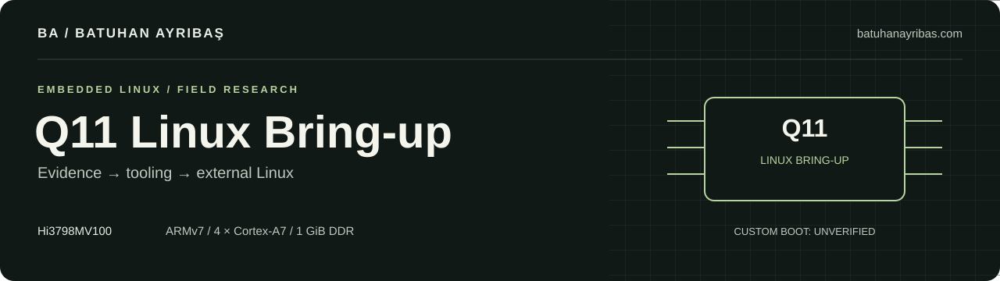

[](https://batuhanayribas.com)

# Huawei Q11 Linux Bring-up

An embedded Linux research project by **[Batuhan Ayrıbaş](https://batuhanayribas.com)**.
The goal is to turn a Huawei Q11 IPTV set-top box into a general-purpose ARMv7
Linux computer, using an external root filesystem and preserving its existing
boot chain where practical.

**Current status: custom Linux has not booted on the Q11, and no usable shell has
been obtained.** Debian rootfs and RAM initramfs tooling are ready. Stock firmware
has successfully mounted the prepared USB ext4 filesystem and used isolated
wired Ethernet. The remaining blocker is a verified execution or RAM-loading path.

[Technical record](Q11_RECORD.md) · [Bring-up procedure](docs/BRINGUP.md) ·
[Rootfs guide](docs/ROOTFS.md) · [Project website](https://batuhanayribas.com)

[](https://github.com/rootcastleco/q11/actions/workflows/validate.yml)

## What works today

| Area | Evidence | Status |
|---|---|---|
| UART capture | CH341A, 3.3 V, 115200 8N1; raw bytes, timing and checksums | **CONFIRMED on Q11** |
| Stock platform | Hi3798MV100, four Cortex-A7 cores, 1 GiB RAM, 256 MiB raw NAND | **CONFIRMED on Q11** |
| USB storage | xHCI mass storage enumerated the prepared stick as `/dev/sda1` | **CONFIRMED on Q11** |
| External ext4 | Mount count changed from 0 to 3; journal recovery bit changed | **CONFIRMED stock mount/write** |
| Stock Ethernet | Direct 100 Mbps link, DHCP lease, ARP and ICMP responses | **CONFIRMED on Q11** |
| Network services | TCP 7547/56789/56790 open; DIAL device descriptor read | **CONFIRMED; no shell** |
| Debian armhf | Bookworm/SysV userspace, SSH public-key configuration and serial console | **HOST VALIDATED** |
| RAM initramfs | Deterministic newc archive, bounded external-root wait and `switch_root` | **HOST VALIDATED** |
| Custom boot / SSH | Image loading, kernel handoff and hardware compatibility | **UNKNOWN / NOT ACHIEVED** |
| Recovery entry | One Xiaomi IR trial reached stock IPTV; HDMI showed no recovery | **FAILED IN THIS TRIAL** |

Experiments use **CONFIRMED**, **LIKELY** and **UNKNOWN** labels. A build result,
mounted filesystem or open TCP port is not evidence of arbitrary code execution.
See the [validation record](docs/VALIDATION.md) for test boundaries and limitations.

## Hardware at a glance

| Component | Observed configuration |
|---|---|
| Device | Huawei Q11 IPTV set-top box |
| SoC / CPU | HiSilicon Hi3798MV100; 4 × ARM Cortex-A7; ARMv7 SMP |
| Memory | 1 GiB DDR; stock firmware reserves 380 MiB for MMZ/CMA |
| Storage | Toshiba 256 MiB raw NAND; 2 KiB pages; 64 B OOB; hinfc610 |
| Stock kernel | Linux `3.18.13_s40`; HiSTBLinuxV100R003C00SPC065 family |
| Stock root | SquashFS loaded into RAM and mounted as `/dev/ram` |
| Writable application data | YAFFS2 `appdata` |
| UART | PL011 `ttyAMA0`; 115200 8N1; measured 3.3 V signaling |
| Ethernet | `hieth`; PHY address 1; isolated stock link tested |
| Graphics | Vendor `hi_fb`, `hi_tde`, HIGO and `hi_hdmi`; custom framebuffer untested |

The [hardware guide](docs/HARDWARE.md) separates addresses printed in Q11 logs
from public SDK candidates. Generic eMMC-box recipes are not Q11 NAND recipes.

## Intended boot path

```text
Existing HiSilicon boot chain
        │  verified loading control still required
        ▼
Stock or board-compatible Linux kernel
        ▼
RAM initramfs → external USB / microSD ext4
        ▼
Debian armhf / SysV init
        ├── serial administrative console
        ├── wired Ethernet and public-key SSH
        ├── persistent external storage
        └── later: HDMI framebuffer and a lightweight desktop
```

The first option is to reuse the stock kernel and its board support. A removable
rootfs alone cannot change boot arguments or replace the stock initrd. Public
BootROM tools and MV100 pin-short reports are research candidates; Q11 entry,
electrical pin identity and a compatible DDR loader remain unverified.

## Start with the host tools

Requirements: Python 3.10+, Git and PowerShell 7 for Windows lab tools. Linux or
WSL is required for rootfs/image builds. Complete dependencies are in the
[rootfs guide](docs/ROOTFS.md). Nmap is optional for the isolated TCP inventory.

```powershell
git clone https://github.com/rootcastleco/q11.git
cd q11
python -m unittest discover -s tests -v
pwsh -NoProfile -File tests/test_powershell.ps1
pwsh -NoProfile -File tests/test_dhcp.ps1
pwsh -NoProfile -File tests/test_port_report.ps1
python tools/analysis/boot_report.py logs --output artifacts/boot-report.json
pwsh -NoProfile -File tools/uart/capture_experiment.ps1 -DryRun
```

These commands validate and analyze on the host; they do not boot or flash Q11.
Generated reports refuse to overwrite an existing output. Use a new report name
when repeating analysis. Physical captures require the verified wiring below.

### UART wiring

The measured lab unit's header is `GND | RX | TX | VCC` in the recorded board
orientation. Establish pin identity and voltage on any other unit first.

```text
Q11 GND ─────────── CH341A GND
Q11 TX  ──────────► CH341A RX
Q11 RX  ◄────────── CH341A TX
Q11 VCC             NOT CONNECTED
```

Use the Q11's own power adapter. Change wiring with Q11 power disconnected. The
tested CH341A uses jumper 2–3 for UART mode; neither its 3.3 V nor 5 V supply is
connected to Q11. The [bring-up guide](docs/BRINGUP.md) gives bounded captures,
physical steps and expected output. Default experiment capture is receive-only.

## Documentation

| Guide | Contents |
|---|---|
| [Technical record](Q11_RECORD.md) | Hardware inventory, complete NAND map, measurements and experiment chronology |
| [Architecture](docs/ARCHITECTURE.md) | Ranked boot paths and the current execution-control blocker |
| [Boot flow](docs/BOOT_FLOW.md) | Exact cmdline, legacy initrd, bootargs and stock startup inspection |
| [Rootfs](docs/ROOTFS.md) | Debian build, deterministic initramfs, external image and USB preparation |
| [Bring-up](docs/BRINGUP.md) | Completed physical trials, next board-identification step and acceptance criteria |
| [Hardware](docs/HARDWARE.md) | Register addresses, DTB detection, card slot and graphics evidence |
| [Kernel](docs/KERNEL.md) | Public vendor source candidates, configuration and build tooling |
| [BootROM](docs/BOOTROM.md) | UART bootstrap, USB host boot, pin-short reports and loader requirements |
| [Network](docs/NETWORK.md) | Isolated DHCP, stock Ethernet, TCP inventory and HTTP/DIAL inspection |
| [Memory](docs/MEMORY.md) | MMZ/CMA accounting and limits on changing memory reservations |
| [Validation](docs/VALIDATION.md) | Tests, physical evidence and what each check does not establish |
| [Tool reference](tools/README.md) | Tool groups, inputs, outputs and historical UART utilities |
| [Contributing](CONTRIBUTING.md) | Evidence standards, testing and handling private captures |
| [Branding](docs/BRANDING.md) | Project identity, attribution and visual assets |

## Repository layout

```text
assets/brand/       Batuhan Ayrıbaş project header
docs/              Architecture, evidence and reproducible lab guides
tools/analysis/    Boot, stock-image, rootfs and filesystem evidence parsers
tools/dtb/         Validated FDT discovery and extraction
tools/rootfs/      Debian, initramfs, external image and USB lab tools
tools/kernel/      Vendor-kernel build wrapper and bring-up config
tools/network/     Bounded DHCP, TCP and read-only service inspection
tools/uart/        Receive-only experiment capture with metadata
tests/             Fixtures and host tests without a connected Q11
logs/              Existing historical UART evidence and hash manifest
photos/            Historical CH341A adapter photos
artifacts/         Generated outputs; ignored by Git
```

Historical Ctrl+C, space and `set` experiments did not expose a bootloader shell.
They are retained as evidence and are not repeated. The IR trial and isolated
network inspection also produced no maintenance console. The next physical
dependency is an unpowered Q11 PCB/package/pad inspection, documented in
[BRINGUP](docs/BRINGUP.md); no verified shorting instruction is available.

## Scope and publication

This project focuses on Linux bring-up on a personally owned device. It does not
develop Pay-TV/CA/DRM bypasses, extract protected credentials or defeat signature
checks. No internal NAND writer or full-NAND backup workflow is supplied. The
external USB writer is a separate, explicit operation with disk-selection guards
and full readback verification; normal build commands write image files only.

Existing historical captures remain byte-for-byte evidence. New raw experiments,
device identifiers, firmware binaries, private SSH keys and generated rootfs
images are kept out of Git. Hardware milestones are documented using non-unique
details and checksums. This is a research repository, not a completed installer.

---

**Batuhan Ayrıbaş · Engineering & Research**

[batuhanayribas.com](https://batuhanayribas.com)

Huawei and HiSilicon names identify the investigated hardware. This is an
independent project, with no claim of vendor affiliation.
