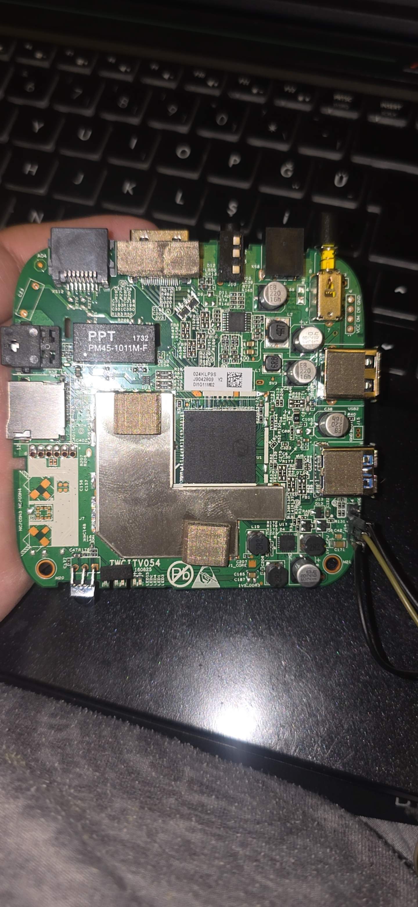
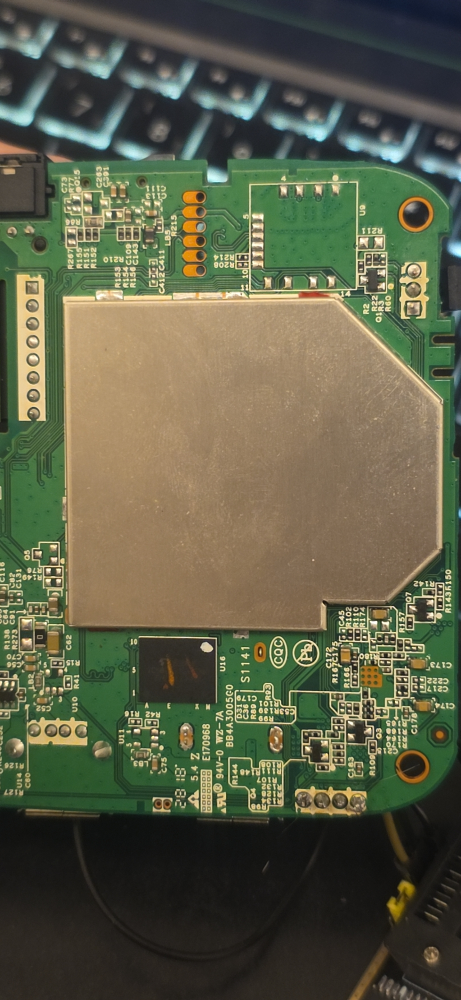
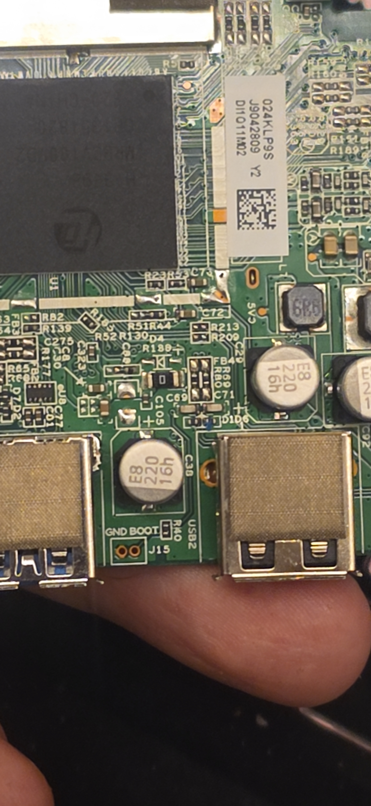
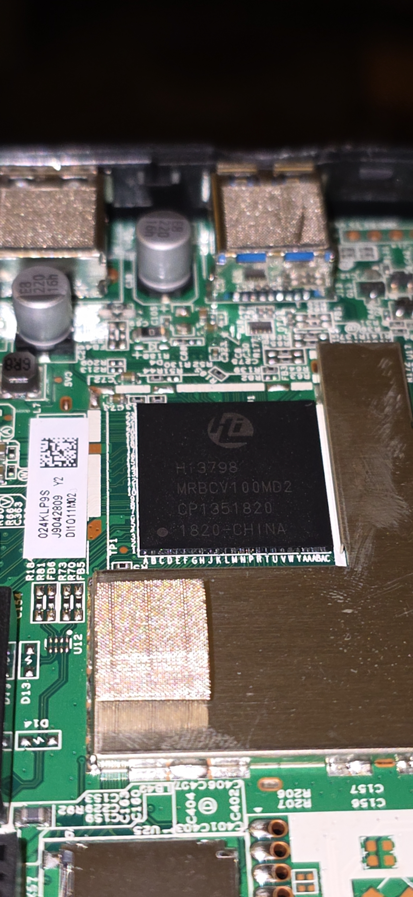
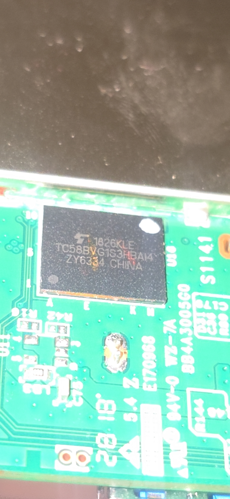
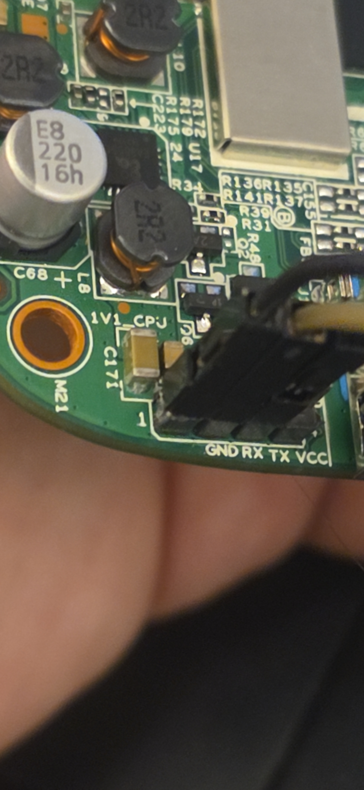

# Q11 board photographs

Photographs supplied by the device owner and reviewed on **2026-10-07** for
[Q11 Linux Bring-up](../README.md). The folder name `resimler` is retained from
the owner's upload. All 26 JPEG files are preserved as supplied; their SHA256
hashes are recorded in [SHA256SUMS.txt](SHA256SUMS.txt).
Byte-identical ` - Copy` files remain in the owner's local folder and are ignored;
the repository contains one supplied file per distinct photograph.

These are photographs of the actual Q11 lab board. They resolve the earlier
absence of board images. They do **not** establish a working BootROM entry,
electrical continuity, safe strap voltage or compatible RAM loader. Some frames
show attached power/UART leads; the electrical power state at capture is unknown.

## Board overview

The component face shows two USB-A sockets, the UART header, exposed U1 SoC and
shielded regions. The reverse face shows U16 NAND. Visible PCB markings include
`TTV054` / `160825` on the component face and `BB4A3005C0` on the reverse face;
these are transcriptions, not a decoded revision/date specification.

## J15: a labelled boot candidate

**CONFIRMED visual evidence:** J15 is an unpopulated two-hole footprint between
the two USB-A sockets, labelled **`GND BOOT`**, next to R40. With that label upright
as in the image above, the hole under `GND` is on the left and the hole under
`BOOT` is on the right. These are silkscreen associations, not measured net names.

**LIKELY:** J15 is intended for a ground/boot strap. **UNKNOWN:** continuity to
board ground and the SoC boot input, active level, pull resistors, sampling timing,
selected boot mode and whether the stock loader can use it. No electrical J15
measurement has been supplied. After the photographic review, the owner reported
briefly bridging/releasing J15; subsequent UART showed stock middleware, with the
entry/power-on interval uncaptured. See the [trial record](../Q11_RECORD.md#owner-reported-j15-trial).
Do not bridge it from the label alone.

The Q11 U1 package has no accessible gull-wing leads in these photographs; its
lettered/numbered PCB coordinate markings are consistent with a BGA package.
The community photograph used for the “107–108” report shows a different,
leaded package. Its “upper-right two legs” instruction does not map to this Q11.
See the [BootROM evidence](../docs/BOOTROM.md).

## Package and header details

| Feature | Photo observation | Interpretation boundary |
|---|---|---|
| U1 SoC | `Hi3798`, `MRBCV100MD2` readable in `20261006_191818.jpg` | Complements the log's Hi3798MV100 identity; package ball map is not established |
| U16 NAND | `TC58BVG1S3HBAI4` readable in `20261007_003856.jpg` | Package transcription; capacity/geometry still come from the boot log |
| UART | `GND RX TX VCC` readable in `20261007_003659.jpg` | Agrees with the measured wiring record; do not infer electrical state from wire colour |
| J9 | Four holes labelled `VCC DM DP GND` in `20261007_003638.jpg` | USB-related label candidate; host/device role, voltage and SoC routing unmeasured |
| Reverse pads | Multiple unpopulated footprints, including a two-row footprint near `MAC` | No confirmed JTAG, recovery or boot pinout |
| Card-style connector | Metal socket and adjacent footprints visible in the overview | Physical card format, SD/MMC routing and detection wiring remain unverified |
| Shielded components | Shields remain fitted in several regions | DDR part numbers/topology cannot be read from these views |

## Complete image index

Click a filename for the supplied full-resolution image. The captions identify
the visible region, without assigning an unverified electrical function.

| File | View |
|---|---|
| [20261006_191757.jpg](20261006_191757.jpg) | U1 and USB sockets; J15 label visible |
| [20261006_191810.jpg](20261006_191810.jpg) | Component-face overview |
| [20261006_191818.jpg](20261006_191818.jpg) | Readable U1 package marking and PCB coordinate labels |
| [20261006_192632.jpg](20261006_192632.jpg) | Reverse-face overview |
| [20261006_192730.jpg](20261006_192730.jpg) | U16 NAND and reverse PCB markings |
| [20261007_003626.jpg](20261007_003626.jpg) | Ethernet/HDMI/power region and J9 labels |
| [20261007_003631.jpg](20261007_003631.jpg) | Component-face overview with attached leads |
| [20261007_003638.jpg](20261007_003638.jpg) | J9 `VCC DM DP GND` and power connector |
| [20261007_003643.jpg](20261007_003643.jpg) | J15 `GND BOOT` between the USB-A sockets |
| [20261007_003648.jpg](20261007_003648.jpg) | UART and nearby power components |
| [20261007_003659.jpg](20261007_003659.jpg) | UART `GND RX TX VCC` close-up |
| [20261007_003708.jpg](20261007_003708.jpg) | Unpopulated component-face footprints near card-style connector |
| [20261007_003714.jpg](20261007_003714.jpg) | U1, shield and USB region |
| [20261007_003721.jpg](20261007_003721.jpg) | U1 coordinate markings, TP1 region and J15 |
| [20261007_003729.jpg](20261007_003729.jpg) | Reverse corner components and mounting hole |
| [20261007_003734.jpg](20261007_003734.jpg) | Reverse two-row footprint and connector solder points |
| [20261007_003739.jpg](20261007_003739.jpg) | Reverse footprint near `MAC` and rear connector |
| [20261007_003748.jpg](20261007_003748.jpg) | Reverse shield, footprints and U16 |
| [20261007_003753.jpg](20261007_003753.jpg) | Reverse-face overview |
| [20261007_003814.jpg](20261007_003814.jpg) | Reverse U16 and nearby pads |
| [20261007_003856.jpg](20261007_003856.jpg) | Readable NAND marking |
| [20261007_003909.jpg](20261007_003909.jpg) | Component-face overview and PCB marking |
| [image-1791310122152.jpg](image-1791310122152.jpg) | Smaller component-face overview |
| [image-1791310213568.jpg](image-1791310213568.jpg) | Smaller power/header-region view |
| [image-1791310220473.jpg](image-1791310220473.jpg) | Alternate power/header-region view |
| [image-1791310253520.jpg](image-1791310253520.jpg) | Smaller UART-region view |

---

Maintained by [Batuhan Ayrıbaş](https://batuhanayribas.com) · Q11 Linux Bring-up
